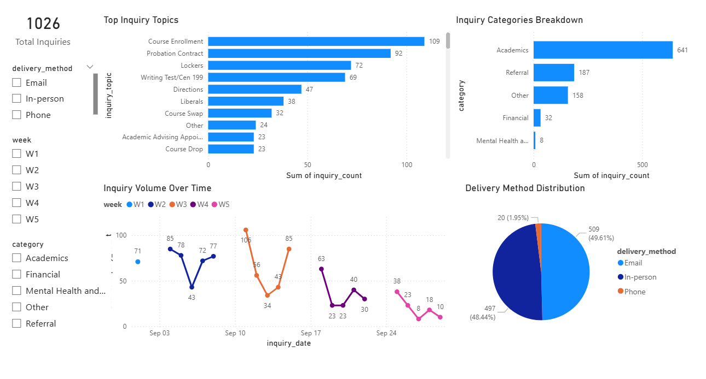

# FYEO Student Inquiry Analytics Pipeline (2024)

## Overview 
The First-Year Engineering Office handled thousands of student inquiries across multiple channels, but data was stored in inconsistent Excel formats, making it difficult to analyze trends and plan resources effectively.

I rebuilt the workflow into a structured analytics pipeline using Excel (Power Query), Python, SQL, and Power BI to standardize, validate, and analyze inquiry data.

This helped highlight that inquiry volumes spike around enrollment deadlines and that most inquiries are academic-related, which can inform staffing and resource planning.

## Tech Stack
- Excel (Power Query)
- Python (pandas)
- SQL (SQLite)
- Power BI

## Process
1. Data cleaning (Power Query)
2. Data processing (Python)
3. Data storage (SQL)
4. Visualization (Power BI)

## Dashboard Preview

## Key Insights for Sept 2023
- Inquiry volume spikes at start of term and key deadlines
- Majority of inquiries are academic-related
- Course enrollment and probation contracts dominate inquiry topics
- Email is the primary communication channel
- Peak weeks align with operational pressure points (e.g., enrollment deadlines)